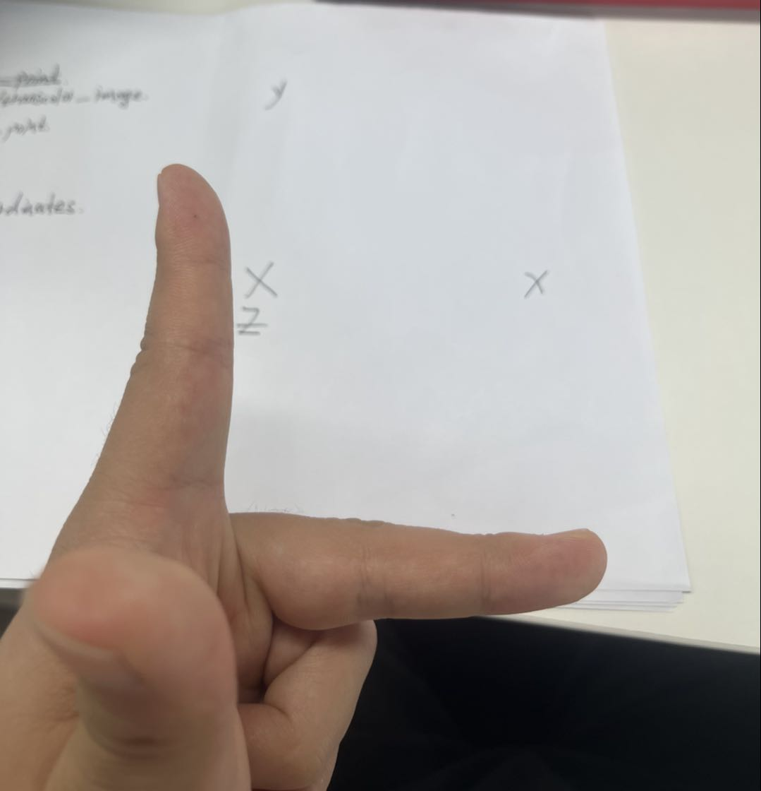
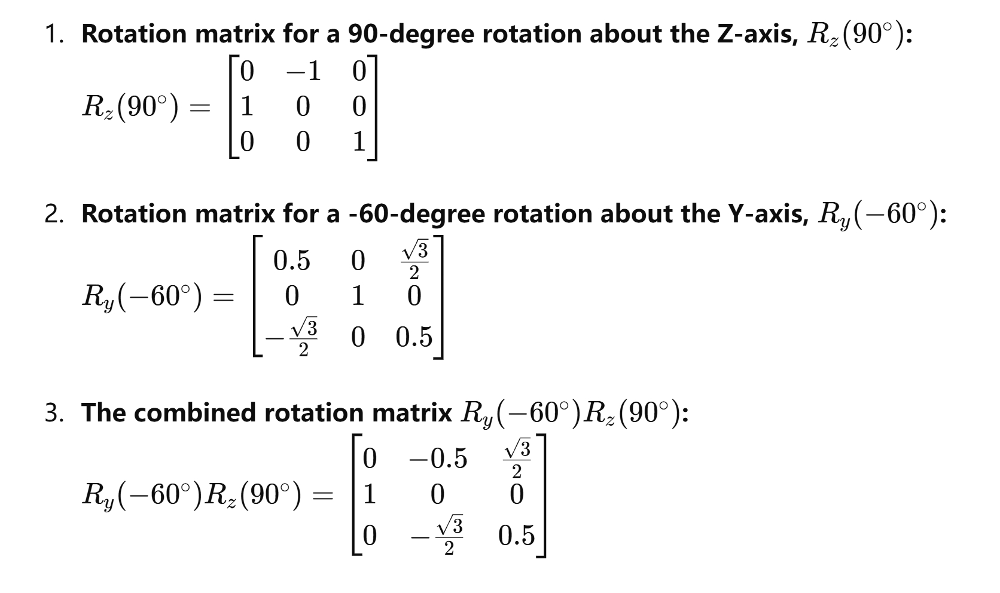
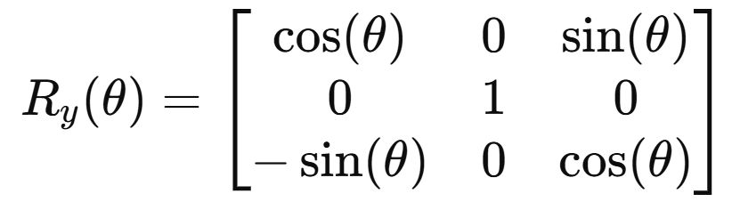
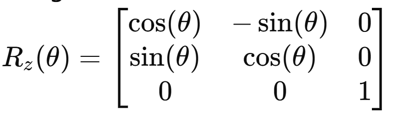
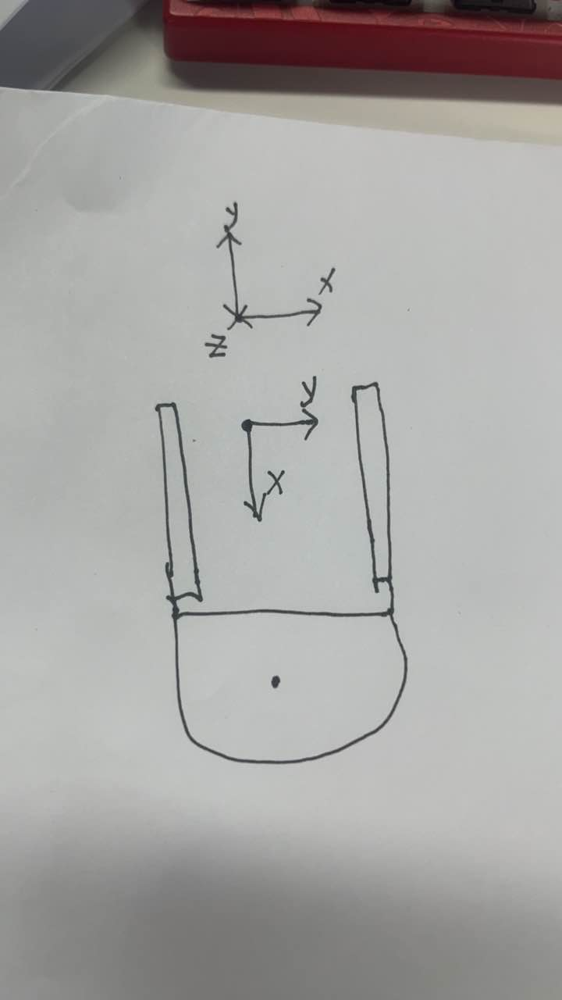

# The-View-Location

just use vzenze camera DS86 to find something and get the location coordinate

And the operator just according to the test.cpp file to revise and just accept the finally the topic name /world_coordinates and you will find you get the right position

if you need to revise the relative camera and vehicle, you need know that :

## translation_vector

To properly fill out the translation matrix, it is necessary to measure and fill it according to the left-handed coordinate system. Below is a schematic representation of the left-handed coordinate system.

## rotation_matrix

请注意：这里一定是左手坐标系。下面不在赘述。
从车体系X向外左手系下，首先进行绕车体逆时针转90°，注意，这里的坐标系是指的空间坐标系，这时相机位置也逆时针转动90°，获得最终所求的旋转矩阵。
前的站做向时针转60°，获得最终所求的旋转矩阵。
注意：这里的旋转计算需在标定好的手行对某体系计算，所有，逆时针旋转这里是正，顺时针旋转这里为负。

It is more hard to understand，just easy and slow down

## warning

我这里还要强调一点，这里的相机系车体系，首先车体系是向内为X轴，右侧为Y轴，而上为Z轴。可以打开camera_tranform_body.cpp文件中进行调整。